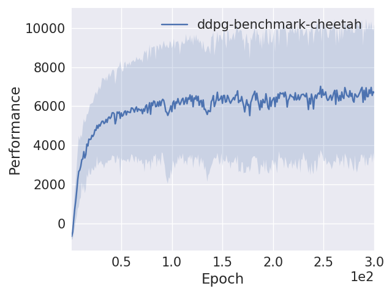

# Deep reinforcement learning algorithms in TensorFlow 2.0

This repository is for deep reinforcement learning algorithms (currently only Deep Deterministic Policy Gradient) using the TensorFlow 2.0 API. Implementations are partly adapted from [Spinning Up](https://github.com/openai/spinningup/).

## Requirements

Essentials are Python >= 3.6, TensorFlow 2.0 and OpenAI Gym. For specifics, see `environment.yml`.

## Train

Train an RL agent using `train.py`

    >>> python train.py --help

    usage: train.py [-h] [--hid HID] [--l L] [--discount DISCOUNT] [--seed SEED]
                    [--epochs EPOCHS] [--exp_name EXP_NAME]
                    algo env

    positional arguments:
    algo                  RL algorithm name, e.g. DDPG
    env                   environment name (from OpenAI Gym)

    optional arguments:
    -h, --help            show this help message and exit
    --hid HID             number of hidden units per hidden layer
    --l L                 number of hidden layers
    --discount DISCOUNT   discount rate (denoted gamma in RL theory)
    --seed SEED, -s SEED  random seed
    --epochs EPOCHS       number of epochs to train
    --exp_name EXP_NAME   name for this experiment, used for the logging folder

## Test

Once training is finished, you can evaluate and visualise the learned policy using `test.py`.

    >>> python test.py --help

    usage: test.py [-h] [--output_dir OUTPUT_DIR] [--env_name ENV_NAME]
                [--episodes EPISODES] [--checkpoint_number CHECKPOINT_NUMBER]

    optional arguments:
    -h, --help            show this help message and exit
    --output_dir OUTPUT_DIR
                            Directory containing config.json and
                            training_checkpoints folder
    --env_name ENV_NAME   Environment name, normally matches training
    --episodes EPISODES   Number of episodes to run
    --checkpoint_number CHECKPOINT_NUMBER
                            Checkpoint to load models from (default latest)

## Demo

If you have a MuJoCo license:

    python test.py ./out/demo/cheetah HalfCheetah-v2

Otherwise:
    
    python test.py ./out/demo/pendulum Pendulum-v0

## Performance

To give some indication of speed: training on the `HalfCheetah-v2` environment for 3 million steps (environment interactions) single-threaded typically takes about 7 hours on a Lenovo ThinkPad T440 with Intel© Core™ i7-4600U CPU @ 2.10GHz × 2.

Replication of the Spinning Up DDPG HalfCheetah [benchmark](https://spinningup.openai.com/en/latest/spinningup/bench.html):

